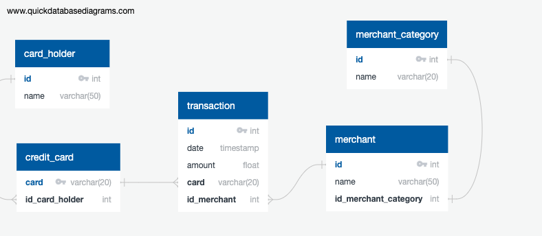

# Fraud database with SQL

## Table of Contents

* [`quickdbd.txt`](#quickdbd-txt)
* [`.sql`](#sql)
* [`.ipynb`](#ipynb)

## `quickdbd.txt`



```
# https://app.quickdatabasediagrams.com/

card_holder
-
id int pk identity
name varchar(50)

credit_card
-
card varchar(20) pk
id_card_holder int fk - card_holder.id

merchant_category
-
id int pk identity
name varchar(15)

merchant
-
id int pk identity
name varchar(50)
id_merchant_category int fk - merchant_category.id

transaction
-
id int pk identity
date  timestamp
amount    float
card    varchar(20) fk - credit_card.card
id_merchant int     fk - merchant.id
```

## `.sql`

```sql
--create database frauddb; -- createdb frauddb -e
--\c frauddb

drop table if exists card_holder       cascade;
drop table if exists credit_card       cascade;
drop table if exists merchant_category cascade;
drop table if exists merchant          cascade;
drop table if exists transaction       cascade;

create table card_holder (
  id       int not null,
  name varchar(50),
  primary key (id)
);

create table credit_card (
  card       varchar(20) not null,
  id_card_holder int,
  foreign key (id_card_holder) references card_holder (id),
  primary key (card)
);

create table merchant_category (
  id       int not null,
  name varchar(15),
  primary key (id)
);

create table merchant (
  id                   int not null,
  name             varchar(50),
  id_merchant_category int not null,
  foreign key (id_merchant_category) references merchant_category (id),
  primary key (id)
);

create table transaction (
  id          int not null,
  date  timestamp not null,
  amount    float,
  card    varchar(20),
  id_merchant int,
  foreign key (card)        references credit_card (card),
  foreign key (id_merchant) references merchant (id),
  primary key (id)
);

-- replace `copy` by `\copy` when using psql
-- an absolute path may be required in certain circumstances

copy card_holder       from 'data/card_holder.csv'       delimiter ',' csv header;
copy credit_card       from 'data/credit_card.csv'       delimiter ',' csv header;
copy merchant_category from 'data/merchant_category.csv' delimiter ',' csv header;
copy merchant          from 'data/merchant.csv'          delimiter ',' csv header;
copy transaction       from 'data/transaction.csv'       delimiter ',' csv header;
  
-- QUERIES
  
select ch.name,
       cc.card,
        t.date,
        t.amount,
        m.name as merchant,
       mc.name as category
from transaction as t
join credit_card as cc
  on cc.card = t.card
join card_holder as ch
  on ch.id = cc.id_card_holder
join merchant as m
  on m.id = t.id_merchant
join merchant_category as mc
  on mc.id = m.id_merchant_category
order by ch.name
);

select count(t.amount) as "Transactions less than $2.00"
from transaction as t
where t.amount < 2;

select *
from transaction as t
where t.amount < 2
order by t.card, t.amount desc;

select *
from transaction as t
where date_part('hour', t.date) >= 7
  and date_part('hour', t.date) <= 9
order by amount desc
limit 100;

select count(t.amount) as "Transactions less than $2.00 during AM"
from transaction as t
where t.amount < 2
and date_part('hour', t.date) >= 7
and date_part('hour', t.date) <= 9;

select   m.name  as merchant,
        mc.name  as category,
 count(t.amount) as micro_transactions
from transaction as t
join merchant as m
  on m.id = t.id_merchant
join merchant_category as mc
  on mc.id = m.id_merchant_category
where t.amount < 2
group by m.name, mc.name
order by micro_transactions desc
limit 5;

-- VIEWS

create view transaction_per_card_holder as
  select ch.name,
         cc.card,
          t.date,
          t.amount,
          m.name as merchant,
         mc.name as category
  from transaction as t
  join credit_card as cc
    on cc.card = t.card
  join card_holder as ch
    on ch.id = cc.id_card_holder
  join merchant as m
    on m.id = t.id_merchant
  join merchant_category as mc
    on mc.id = m.id_merchant_category
  order by ch.name;
  
create view micro_transactions as
  select *
  from transaction as t
  where t.amount < 2
  order by t.card, t.amount desc;
  
create view count_micro_transactions as
  select count(t.amount) as "Transactions less than $2.00"
  from transaction as t
  where t.amount < 2;
  
create view morning_higher_transactions as
  select *
  from transaction as t
  where date_part('hour', t.date) >= 7
    and date_part('hour', t.date) <= 9
  order by amount desc
  limit 100;
  
create view count_micro_transaction_morning as
  select count(t.amount) as "Transactions less than $2.00 during AM"
  from transaction as t
  where t.amount < 2
  and date_part('hour', t.date) >= 7
  and date_part('hour', t.date) <= 9;
  
create view top_hacked_merchants_micro_transactions as
  select   m.name  as merchant,
          mc.name  as category,
   count(t.amount) as micro_transactions
  from transaction as t
  join merchant as m
    on m.id = t.id_merchant
  join merchant_category as mc
    on mc.id = m.id_merchant_category
  where t.amount < 2
  group by m.name, mc.name
  order by micro_transactions desc
  limit 5;
  
--drop database frauddb; -- dropdb frauddb -e
```

## `.ipynb`

```python
import numpy        as np
import numpy.random as npr
import pandas       as pd

import hvplot.pandas
import plotly.express as px

from sqlalchemy import create_engine

import calendar

conn = create_engine('postgresql://postgres@localhost:5432/frauddb')

# transactions, ordered by card holder
query = '''
select *
from transaction_per_card_holder;
'''
df = pd.read_sql(query, conn)

# transactions less than $2.00
query ='''
select *
from micro_transactions;
'''
df = pd.read_sql(query, conn)

# the number of transactions that are less than $2.00
query = '''
select *
from count_micro_transactions;
'''
df = pd.read_sql(query, conn)

# the top 100 transactions between 07:00 and 09:00
query = '''
select *
from morning_higher_transactions;
'''
df = pd.read_sql(query, conn)

# the number of transactions less than $2.00 between 07:00 and 09:00
query = '''
select *
from count_micro_transaction_morning;
'''
df = pd.read_sql(query, conn)

# top 5 merchants prone to being hacked using small transactions
query = '''
select *
from top_hacked_merchants_micro_transactions;
'''
df = pd.read_sql(query, conn)

# Who are card holders 2 and 18?
query = '''
select *
from card_holder
where id in (2, 18);
'''
df = pd.read_sql(query, conn)

# Which credit card numbers are associated with card holders 2 and 18?
query = '''
select ch.name,
       cc.card
from card_holder as ch
join credit_card as cc
  on ch.id = cc.id_card_holder
where ch.id in (2, 18);
'''
df = pd.read_sql(query, conn)

# get card holder 2, 18 transactions
query = '''
select ch.id as cardholder,
        t.date as datetime,
        t.amount
from transaction as t
join credit_card as cc
  on cc.card = t.card
join card_holder as ch
  on ch.id = cc.id_card_holder
where ch.id in (2, 18)
order by datetime;
'''
tdf = pd.read_sql(query, conn)

tdf.groupby('cardholder') \
  .agg([len, sum]) \
  .astype({('amount', 'len'): int}) \
  .style.format({('amount', 'sum'): '${:,.2f}'})

data_2      = tdf[tdf.cardholder == 2]
data_2_plot = data_2.hvplot.line(x    ='datetime',
                                 y    ='amount',
                                 label='Card Holder 2')

data_18      = tdf[tdf.cardholder == 18]
data_18_plot = data_18.hvplot.line(x    ='datetime',
                                   y    ='amount',
                                   label='Card Holder 18')

data_plot = data_2_plot * data_18_plot
data_plot.opts(
  title ='Transactions Analysis for Card Holders 2 and 18',
  xlabel='Datetime',
  ylabel='Transaction Amount'
)

query = '''
select date_part('month', t.date) as month,
       date_part('day',   t.date) as day,
                          t.amount
from transaction as t
join credit_card as cc
  on cc.card = t.card
join card_holder as ch
  on ch.id = cc.id_card_holder
where ch.id = 25
  and date_part('month', t.date) <= 6
order by month, day;
'''
df = pd.read_sql(query, conn)

for i in range(df.shape[0]):
  df.iloc[i, 0] = calendar.month_name[int(df.iloc[i, 0])]
  
px.box(
  df,
  x      ='month',
  y      ='amount',
  title  ='Monthly Transactions Analysis for Card Holder 25',
  labels ={'month'  : 'Month',
           'amount' : 'Transaction Amount'},
  color  ='month',
  boxmode='overlay',
)

def locate_outliers_std (card_holder=1):
  query = (
    f'select t.date, t.amount, t.card '
    f'from transaction as t '
    f'join credit_card as cc on cc.card = t.card '
    f'join card_holder as ch on ch.id = cc.id_card_holder '
    f'where ch.id = {str(card_holder)} '
    f'order by date;'
  )
  data = pd.read_sql(query, conn)
  elements = data['amount']
  
  mean = elements.mean(axis=0)
  std  = elements.std( axis=0)
  
  low_outliers  = [x for x in elements if (x < mean - 2 * std)]
  high_outliers = [x for x in elements if (x > mean + 2 * std)]
  
  outliers = low_outliers + high_outliers
  if len(outliers) > 0:
    query = (
      f'select t.date, t.amount, t.card '
      f'from transaction as t '
      f'join credit_card as cc on cc.card = t.card '
      f'join card_holder as ch on ch.id = cc.id_card_holder '
      f'where ch.id = {str(card_holder)} and t.amount in ({str(outliers)[1:-1]}) '
      f'order by date;'
    )
    data = pd.read_sql(query, conn)
    return data
  else:
    return 'There are no fraudulent transactions identified for this card holder.'
  
for i in range(1, 4):
  card_holder_id = npr.randint(1, 25)
  print('*' * 60)
  print(f'Looking for fraudulent transactions for card holder id {card_holder_id}')
  print(locate_outliers_std(card_holder_id))
  
def locate_outliers_iqr (card_holder=1):
  query = (
    f'select t.date, t.amount, t.card '
    f'from transaction as t '
    f'join credit_card as cc on cc.card = t.card '
    f'join card_holder as ch on ch.id = cc.id_card_holder '
    f'where ch.id = {str(card_holder)} '
    f'order by date;'
  )
  data = pd.read_sql(query, conn)
  q25, q75 = np.percentile(data['amount'], 25), np.percentile(data['amount'], 75)
  iqr = q75 - q25
  lbound, ubound = q25 - 1.5*iqr, q75 + 1.5*iqr
  outliers = [x for x in data['amount'] if x < lbound or x > ubound]
  if len(outliers) > 0:
    query = (
      f'select t.date, t.amount, t.card '
      f'from transaction as t '
      f'join credit_card as cc on cc.card = t.card '
      f'join card_holder as ch on ch.id = cc.id_card_holder '
      f'where ch.id = {str(card_holder)} and t.amount in ({str(outliers)[1:-1]}) '
      f'order by date;'
    )
    data = pd.read_sql(query, conn)
    return data
  else:
    return 'There are no fraudulent transactions identified for this card holder.'
  
for i in range(1, 4):
  card_holder_id = npr.randint(1, 25)
  print('*' * 60)
  print(f'Looking for fraudulent transactions for card holder id {card_holder_id}')
  print(locate_outliers_iqr(card_holder_id))
```