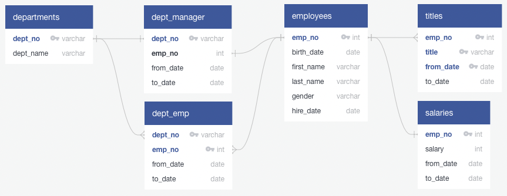

# SQL

## Table of Contents

* [`queries.sql`](#queriessql)
* [`quickdbd.txt`](#quickdbdtxt)

## `queries.sql`

```sql
--create database employeedb; -- createdb employeedb -e
--\c employeedb

drop table if exists departments     cascade;
drop table if exists employees       cascade;
drop table if exists dept_manager    cascade;
drop table if exists dept_emp        cascade;
drop table if exists salaries        cascade;
drop table if exists titles          cascade;
drop table if exists retirement_info cascade;
drop table if exists current_emp     cascade;
drop table if exists emp_info        cascade;
drop table if exists manager_info    cascade;
drop table if exists dept_info       cascade;
drop table if exists sales_info      cascade;
drop table if exists sales_dev       cascade;
drop table if exists ret_titles      cascade;
drop table if exists unique_titles   cascade;
drop table if exists retiring_titles cascade;

create table departments (
  dept_no   varchar( 4) not null,
  dept_name varchar(40) not null,
  primary key (dept_no),
  unique    (dept_name)
);

create table employees (
  emp_no         int not null,
  birth_date    date not null,
  first_name varchar not null,
  last_name  varchar not null,
  gender     varchar not null,
  hire_date     date not null,
  primary key (emp_no)
);

create table dept_manager (
  dept_no   varchar(4) not null,
  emp_no        int    not null,
  from_date    date    not null,
  to_date      date    not null,
  foreign key  (emp_no) references employees    (emp_no),
  foreign key (dept_no) references departments (dept_no),
  primary key  (emp_no,
               dept_no)
);

create table dept_emp (
  emp_no        int    not null,
  dept_no   varchar(4) not null,
  from_date    date    not null,
  to_date      date    not null,
  foreign key  (emp_no) references employees    (emp_no),
  foreign key (dept_no) references departments (dept_no),
  primary key  (emp_no,
               dept_no)
);

create table salaries (
  emp_no     int not null,
  salary     int not null,
  from_date date not null,
  to_date   date not null,
  foreign key (emp_no) references employees (emp_no),
  primary key (emp_no)
);

create table titles (
  emp_no        int     not null,
  title     varchar(50) not null,
  from_date    date     not null,
  to_date      date,
  foreign key (emp_no) references employees (emp_no),
  primary key (emp_no,
                title,
            from_date)
);

-- replace `copy` by `\copy` when using psql and a relative path
-- an absolute path is required in certain circumstances

copy departments  from 'data/departments.csv'  delimiter ',' csv header;
copy employees    from 'data/employees.csv'    delimiter ',' csv header;
copy dept_manager from 'data/dept_manager.csv' delimiter ',' csv header;
copy dept_emp     from 'data/dept_emp.csv'     delimiter ',' csv header;
copy salaries     from 'data/salaries.csv'     delimiter ',' csv header;
copy titles       from 'data/titles.csv'       delimiter ',' csv header;

select emp_no,
       first_name,
       last_name
into retirement_info
from employees
where (birth_date between '1952-01-01' and '1955-12-31')
and   (hire_date  between '1985-01-01' and '1988-12-31');

copy retirement_info to 'data/retirement_info.csv' delimiter ',' csv header;

select count(first_name) -- 41380
from employees
where (birth_date between '1952-01-01' and '1955-12-31')
and   (hire_date  between '1985-01-01' and '1988-12-31');

select d.dept_name,
      dm.emp_no,
      dm.from_date,
      dm.to_date
from departments        as d
inner join dept_manager as dm
  on d.dept_no = dm.dept_no
where dm.to_date = ('9999-01-01');

--     dept_name      | emp_no | from_date  |  to_date
----------------------+--------+------------+------------
-- Marketing          | 110039 | 1991-10-01 | 9999-01-01
-- Finance            | 110114 | 1989-12-17 | 9999-01-01
-- Human Resources    | 110228 | 1992-03-21 | 9999-01-01
-- Production         | 110420 | 1996-08-30 | 9999-01-01
-- Development        | 110567 | 1992-04-25 | 9999-01-01
-- Quality Management | 110854 | 1994-06-28 | 9999-01-01
-- Sales              | 111133 | 1991-03-07 | 9999-01-01
-- Research           | 111534 | 1991-04-08 | 9999-01-01
-- Customer Service   | 111939 | 1996-01-03 | 9999-01-01
--(9 rows)

select ri.emp_no,
       ri.first_name,
       ri.last_name,
       de.to_date
into current_emp
from retirement_info as ri
left join dept_emp   as de
  on ri.emp_no = de.emp_no
where de.to_date = ('9999-01-01');

copy current_emp to 'data/current_emp.csv' delimiter ',' csv header;

select count(ce.emp_no), de.dept_no
from current_emp   as ce
left join dept_emp as de
  on ce.emp_no = de.emp_no
group by de.dept_no
order by de.dept_no;

-- count | dept_no
---------+---------
--  2199 | d001
--  1908 | d002
--  1953 | d003
--  8174 | d004
--  9281 | d005
--  2234 | d006
--  5860 | d007
--  2413 | d008
--  2597 | d009
--(9 rows)

select e.emp_no,
       e.first_name,
       e.last_name,
       e.gender,
       s.salary,
      de.to_date
into emp_info
from employees      as e
inner join salaries as s
  on (e.emp_no = s.emp_no)
inner join dept_emp as de
  on (e.emp_no = de.emp_no)
where  (e.birth_date between '1952-01-01' and '1955-12-31')
and    (e.hire_date  between '1985-01-01' and '1988-12-31')
and   (de.to_date = '9999-01-01');

copy emp_info to 'data/emp_info.csv' delimiter ',' csv header;

select dm.dept_no,
        d.dept_name,
       dm.emp_no,
       ce.last_name,
       ce.first_name,
       dm.from_date,
       dm.to_date
into manager_info
from dept_manager      as dm
inner join departments as d
  on (dm.dept_no = d.dept_no)
inner join current_emp as ce
  on (dm.emp_no = ce.emp_no);
  
copy manager_info to 'data/manager_info.csv' delimiter ',' csv header;

select ce.emp_no,
       ce.first_name,
       ce.last_name,
        d.dept_name
into dept_info
from current_emp       as ce
inner join dept_emp    as de
  on (ce.emp_no = de.emp_no)
inner join departments as d
  on (de.dept_no = d.dept_no);
  
copy dept_info to 'data/dept_info.csv' delimiter ',' csv header;

select ce.emp_no,
       ce.first_name,
       ce.last_name,
        d.dept_name
into sales_info
from current_emp       as ce
inner join dept_emp    as de
  on (ce.emp_no = de.emp_no)
inner join departments as d
  on (de.dept_no = d.dept_no)
where d.dept_name = 'Sales';

copy sales_info to 'data/sales_info.csv' delimiter ',' csv header;

select ce.emp_no,
       ce.first_name,
       ce.last_name,
        d.dept_name
into sales_dev
from current_emp       as ce
inner join dept_emp    as de
  on (ce.emp_no = de.emp_no)
inner join departments as d
  on (de.dept_no = d.dept_no)
where d.dept_name in ('Sales', 'Development')
order by ce.emp_no;

copy sales_dev to 'data/sales_dev.csv' delimiter ',' csv header;

select ce.emp_no,
       ce.first_name,
       ce.last_name,
       ti.title,
       ti.from_date,
       ti.to_date
into ret_titles
from employees    as ce
inner join titles as ti
  on (ce.emp_no = ti.emp_no)
where birth_date between '1952-01-01' and '1955-12-31'
order by ce.emp_no;

copy ret_titles to 'data/ret_titles.csv' delimiter ',' csv header;

select * from ret_titles;

select distinct on (emp_no) emp_no,
                            first_name,
                            last_name,
                            title
into unique_titles
from ret_titles
where to_date = ('9999-01-01')
order by emp_no asc;

copy unique_titles to 'data/unique_titles.csv' delimiter ',' csv header;

select * from unique_titles;

select count(title),
             title
into retiring_titles
from unique_titles
group by title
order by count desc;

copy retiring_titles to 'data/retiring_titles.csv' delimiter ',' csv header;

select * from retiring_titles;

-- count |       title
---------+--------------------
-- 25916 | Senior Engineer
-- 24926 | Senior Staff
--  9285 | Engineer
--  7636 | Staff
--  3603 | Technique Leader
--  1090 | Assistant Engineer
--     2 | Manager
--(7 rows)

select distinct on (e.emp_no)  e.emp_no,
                               e.first_name,
                               e.last_name,
                               e.birth_date,
                              de.from_date,
                              de.to_date,
                              ti.title
into mentorship
from employees      as e
inner join dept_emp as de
  on (e.emp_no = de.emp_no)
inner join titles   as ti
  on (e.emp_no = ti.emp_no)
where (de.to_date = '9999-01-01')
and (e.birth_date between '1965-01-01' and '1965-12-31')
order by e.emp_no;

copy mentorship to 'data/mentorship.csv' delimiter ',' csv header;

select * from mentorship;

--drop database employeedb; -- dropdb employeedb -e
```

## `quickdbd.txt`



```
# https://app.quickdatabasediagrams.com/

departments
-
dept_no   varchar pk
dept_name varchar

employees
-
emp_no         int pk
birth_date    date
first_name varchar
last_name  varchar
gender     varchar
hire_date     date

dept_manager
-
dept_no varchar pk fk - departments.dept_no
emp_no      int    fk - employees.emp_no
from_date  date
to_date    date

dept_emp
-
dept_no varchar pk fk >- departments.dept_no
emp_no      int pk fk >- employees.emp_no
from_date  date
to_date    date

salaries
-
emp_no     int pk fk - employees.emp_no
salary     int
from_date date
to_date   date

titles
-
emp_no     int pk fk >- employees.emp_no
title  varchar pk
from_date date pk
to_date   date
```